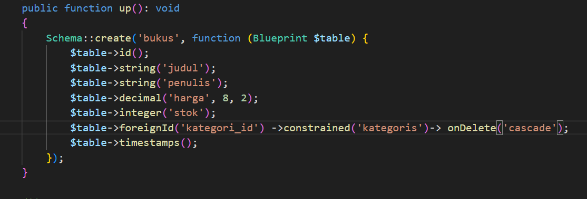

Persiapan:
1.Instal laravel:

2.Konfigurasi database dalam file .env:

3.Kemudian jalankan perintah php artisan migrate.

Membuat API CRUD 

1.buat migration dan model untuk kategori dan buku:

Kemudian edit file migration 'create_kategoris_table.php':

Selanjutnya edit file table bukus:

Lalu jalankan perintah php artisan migrate untuk melakukan migrasi

2.Membuat Controller API untuk buku dan kategori:

Lalu isi file KategoriController.php:

3.Menambahkan Route API:

4.Testing API dengan Postman
Langkah pertama php artisan serve
Selanjutnya testing endpoint menggunakan postman:
a. Get semua kategori:

b. Post untuk menambah kategori baru:

c. Get semua buku:

d. Post untuk menambah buku baru:

E. Get buku berdasarkan id:

F. Put Update data buku berdasarkan id 1:

G. Delete untuk menghapus buku:

Tugas:
1.Tambahkan validasi:
nama buku tidak boleh kosong
harga minimal Rp 1.000

2.Buatlah rancangan endpoint baru untuk mencari buku berdasarkan kategori atau judul:

3.Uji api secara publik: